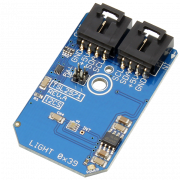

# TSL2571

The TSL2571 family of devices provides ambient light sensing (ALS) that approximates human eye response to light intensity under a variety of lighting conditions and through a variety of attenuation materials. The Mini Module form factor delivered by NCD is ideal for rapid prototyping and hobbyist applications, employing a simple I2C connector to make this device more accessible on all computing platforms.

The Mini Module pictured above can be found [here](https://store.ncd.io/product/tsl2571-light-to-digital-converter-programmable-analog-gain-i2c-mini-module/)

You can find additional information about this repository in the programming language folders.
